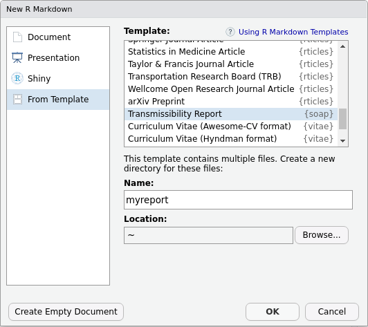

<!-- README.md is generated from README.Rmd. Please edit that file -->

```{r, include = FALSE}
knitr::opts_chunk$set(
  collapse = TRUE,
  comment = "#>",
  fig.path = "man/figures/README-",
  out.width = "100%"
)
```

# soap: A Store of Outbreak Analytics Pipelines

<!-- badges: start -->
[](https://github.com/epiverse-trace/data_pipelines/actions/workflows/R-CMD-check.yaml)
[](https://app.codecov.io/gh/epiverse-trace/data_pipelines?branch=main)
[](https://lifecycle.r-lib.org/articles/stages.html#experimental)
<!-- badges: end -->

This package provides a store of curated outbreak analytics pipelines as 
rmarkdown reports.

## Target audience

The analyses are largely automated, and should be of use to any outbreak
analyst. A basic R literacy will be required to adapt the report to other
datasets.

## Installation

You can install the development version of soap from [GitHub](https://github.com/) with:

``` r
# install.packages("devtools")
devtools::install_github("epiverse-trace/data_pipelines")
```

## Usage

Reports are provided a [rmarkdown templates](https://rstudio.github.io/rstudio-extensions/rmarkdown_templates.html). You can load them either via RStudio graphical interface



or by running:

```{r, eval = FALSE}
rmarkdown::draft(file = "myreport.Rmd", template = "transmissibility-report", package = "soap")
```

To get a list of the template reports available in this package, you can run:

```{r}
soap::list_templates()
```

