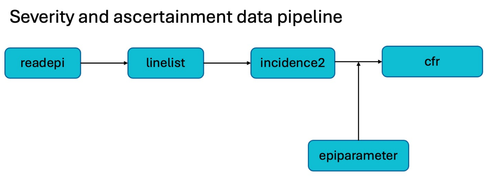

```{r settings, echo = FALSE}
knitr::opts_chunk$set(
  fig.width = 9,
  fig.height = 5,
  dpi = 180,
  collapse = TRUE,
  message = FALSE,
  warning = FALSE,
  out.width = "100%",
  fig.showtext = TRUE
)
showtext::showtext_auto()
```

# Outline of the report

This report estimates disease severity in a population, and estimates the proportion of cases that have been ascertained during an infectious disease outbreak. It performs descriptive analyses, and uses the methods by Nishiura et al to estimate severity, and by Russell et al to estimate ascertainment. Key steps of the report include:

* importing the data from an external file
* identifying key variables in the data
* producing global and stratified plots to visualise cases and deaths over time
* estimating the case fatality risk (CFR)
* estimating the proportion of ascertained cases

```{r diplay-pipeline}

```

```{r load-packages}
#The following code loads required packages; missing packages will be installed
#automatically, but will require a working internet connection for the
#installation to be successful.

library(dplyr)
library(cfr)
library(ggplot2)
library(forcats)
library(purrr)
library(tidyr)
library(rio)
library(linelist)
library(janitor)
library(kableExtra)
library(grateful)
library(epiparameter)
library(incidence2)
library(binom)
```

```{r define-theme}
custom_grey <- "#505B5B"
green_grey <- "#5E7E80"
pale_green <- "#B2D1CC"
dark_green <- "#005C5D"
dark_pink <- "#B45D75"

#theme_set(tracetheme::theme_trace())
```

<!--
### System dependencies

You may need to install system dependencies to be able to generate this report:

```sh
# macOS
brew install libsodium cmake

# Linux (Debian based)
apt install libsodium-dev cmake
```
-->

##  Importing the data

```{r define-data-path}
# To adapt this report to another dataset, change the name of
# the file in the `data_file` parameter at the top of this document.
# Supported file types include .xlsx, .csv, and many others, please visit
# https://gesistsa.github.io/rio/#supported-file-formats for more information.
# The following code is used to rename your input data set as `dat_raw`.
data_path <- params$data_file
```

```{r import-data}
# This code imports the input dataset from the data path specified by the user
# (params$data_path)
dat_raw <- data_path %>%
  import() %>%
  tibble() %>%
  # rio (via readxl) tends to use POSIXct for what is encoded as Date in the
  # original data file.
  # But POSIXct is not a good format to work with dates, as discussed in
  # https://github.com/reconverse/incidence2/issues/105
  mutate(across(where(\(x) inherits(x, "POSIXct")), as.Date))
```

Data used in this report contains the following variables:

```{r preview-data}
# This is what the data used in this report, `dat_raw`, looks like:
head(dat_raw) %>%
  kbl() %>%
  kable_styling()
```

```{r, eval=params$data_type== "Linelist", child=paste0("rmdchunks/id_key_data_linelist.Rmd")}
```

## Descriptive analyses

### Visualisation of cases and deaths

In this section, the progression of cases and deaths over time is visualised, with and without stratification by `r group_var`.

```{r process-dates-onset-death}
# This code converts daily incidence into weekly incidence using {incidence2}
dat_i <- dat_raw %>%
    incidence(date_index = c(cases, deaths),
    interval = 1L,
    counts = count_var,
    groups = group_var
  )
```

```{r display-stratified-epicurves}
# Plot to visualise cases and deaths over time stratified by group_var
dat_i %>%
  plot(alpha = 1,) +
  labs(x = "", y = "Incidence")
```

## Onset to death delay

### Explanations

Given the natural progression of infectious diseases, there will be a time delay, of days or even weeks, between the onset of disease symptoms in cases and their death. In real time during an outbreak, this inevitable delay means that, as cases are detected or notified, it will not be possible to know the true proportion of cases that result in death until after a period of time, as it is unclear whether they will died or recovered.
The specific time delay between symptom onset and death will vary between infectious diseases, and by collecting data from past epidemics, it is possible to obtain a reliable estimate of the delay's mathematical distribution.
In this report, the case fatality risk is estimated and adjusted to take into consideration the expected delay between symptom onset and death for `r params$disease_name`. The mean and standard deviation values for the onset to death delay have been `r ifelse(params$use_epiparameter_database, "obtained from a library of epidemiological parameters from the {epiparameter} R package", "provided as an input by the author")`.

```{r define-onset-death-epiparameter, eval = params$use_epiparameter_database}
# If params$use_epiparameter_database=TRUE, this code accesses the
# {epiparameter} package library of epidemiological parameters to obtain an onset to death
# distribution for params$disease_name, and creates an `epiparameter` object.
onset_death_epiparameter <- epiparameter_db(
  disease =  params$disease_name,
  epi_dist =  "onset to death",
  single_epiparameter = TRUE,
  subset = is_parameterised
)
```

```{r define-onset-death, eval = !params$use_epiparameter_database}
# If params$use_epiparameter_database=FALSE, this code takes the mean and sd for
# the onset to death delay provided by the user and creates an epiparameter object
onset_death_epiparameter <- epiparameter(
  disease = params$disease_name,
  epi_dist = "onset to death",
  prob_distribution = params$onset_death_dist,
  summary_stats = create_summary_stats(
    mean = params$onset_death_mean,
    sd = params$onset_death_sd
  ),
  auto_calc_params = TRUE
)
```

```{r plot epiparameter}
o_d_params <- get_parameters(onset_death_epiparameter)
plot(onset_death_epiparameter)
```

## Estimation of case fatality risk (CFR)

### Explanations

The Case Fatality Risk or Ratio (CFR) measures disease severity by indicating the proportion of deaths among reported cases. This report provides a static CFR measure, which indicates the overall proportion of deaths, from start to end of the dataset provided by the author; as well as a time-varying CFR estimate, to display how the severity of disease has changed over time during the outbreak of `r params$disease_name`. Both estimates correct for reporting delays, by using a delay distribution of the time between symptom onset and outcome (death), which has been `r ifelse(params$use_epiparameter_database, "obtained from a library of epidemiological parameters from the {epiparameter} R package", "provided as an input by the author")`.

### Static severity estimation

```{r incidence-for-cfr, eval=params$data_columns != "Dates of onset and total deaths only", echo=params$data_columns != "Dates of onset and total deaths only"}
dat_i_cfr <- dat_raw %>%
    incidence(date_index = c(cases, deaths),
    interval = 1L
  )
```


```{r static-severity-adjusted-table, eval=params$data_columns != "Dates of onset and total deaths only", echo=params$data_columns != "Dates of onset and total deaths only"}
# Prepare data for CFR
data_for_cfr <- prepare_data(dat_i_cfr, cases_variable = cases, deaths_variable = deaths)
data_for_cfr$date <- as.Date(data_for_cfr$date)

# Estimate static CFR
cfr_static <- cfr_static(data_for_cfr, function(x) dgamma(x, shape = o_d_params[["shape"]], scale = o_d_params[["scale"]]))

# Create a data frame with CFR and confidence intervals
cfr_table <- data.frame(
  CFR = round(cfr_static$severity_estimate, 3),
  `Lower CI` = round(cfr_static$severity_low, 3),
  `Upper CI` = round(cfr_static$severity_high, 3),
  check.names = FALSE
)

# Display the table using knitr::kable
knitr::kable(cfr_table, caption = "Case Fatality Risk (CFR) with Confidence Intervals")
```

```{r incidence-for-cfr2, eval=params$data_columns == "Dates of onset and total deaths only", echo=params$data_columns == "Dates of onset and total deaths only"}
# Adding dummy column with death dates
dat_raw <- dat_raw %>%
  mutate(deaths = .[[cases]])

dat_i_cfr <- dat_raw %>%
    incidence(date_index = c(cases, deaths),
    interval = 1L,
    complete_dates = TRUE
  )
```

```{r static-severity-adjusted-table2, eval=params$data_columns == "Dates of onset and total deaths only", echo=params$data_columns == "Dates of onset and total deaths only"}
# Prepare data for CFR
data_for_cfr <- prepare_data(dat_i_cfr, cases_variable = cases, deaths_variable = deaths)
data_for_cfr$date <- as.Date(data_for_cfr$date)

# Estimate proportion of cases with an expected known outcome
est_outcomes <- estimate_outcomes(data_for_cfr, function(x) dgamma(x, shape = o_d_params[["shape"]], scale = o_d_params[["scale"]]))
total_outcomes <- sum(est_outcomes$estimated_outcomes)

# Estimate CFR based on ratio of deaths to cases with known outcomes
cfr_static <- binom.confint(total_fatalities, total_outcomes, methods = "wilson")[, c("mean", "lower", "upper")]

# Create a data frame with CFR and confidence intervals
cfr_table <- data.frame(
  CFR = round(cfr_static$mean, 3),
  `Lower CI` = round(cfr_static$lower, 3),
  `Upper CI` = round(cfr_static$upper, 3),
  check.names = FALSE
)

# Display the table using knitr::kable
knitr::kable(cfr_table, caption = "Case Fatality Risk (CFR) with Confidence Intervals")
```

```{r, eval=params$data_columns != "Dates of onset and total deaths only", child=paste0("rmdchunks/cfr_time_varying.Rmd")}
```

```{r}
grateful::cite_packages(output = "paragraph", out.dir = ".", pkgs = "Session")
```


