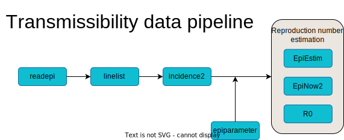

```{r lockfile, include = FALSE, message = FALSE}
renv::use(
  "backports@1.5.0",
  "base64enc@0.1-3",
  "bit@4.0.5",
  "bit64@4.0.5",
  "bslib@0.7.0",
  "cachem@1.1.0",
  "cellranger@1.1.0",
  "checkmate@2.3.1",
  "cli@3.6.2",
  "clipr@0.8.0",
  "colorspace@2.1-0",
  "commonmark@1.9.1",
  "cpp11@0.4.7",
  "crayon@1.5.2",
  "curl@5.2.1",
  "data.table@1.15.4",
  "digest@0.6.35",
  "distcrete@1.0.3",
  "distributional@0.4.0",
  "dplyr@1.1.4",
  "epiverse-trace/epiparameter@328706e", # nolint 
  "evaluate@0.24.0",
  "fansi@1.0.6",
  "farver@2.1.2",
  "fastmap@1.2.0",
  "fontawesome@0.5.2",
  "forcats@1.0.0",
  "foreign@0.8-86",
  "fs@1.6.4",
  "generics@0.1.3",
  "ggplot2@3.5.1",
  "glue@1.7.0",
  "grateful@0.2.4",
  "grates@1.2.1",
  "gtable@0.3.5",
  "haven@2.5.4",
  "highr@0.11",
  "hms@1.1.3",
  "htmltools@0.5.8.1",
  "httpuv@1.6.15",
  "incidence2@2.3.1",
  "isoband@0.2.7",
  "janitor@2.2.0",
  "jquerylib@0.1.4",
  "jsonlite@1.8.8",
  "kableExtra@1.4.0",
  "knitr@1.47",
  "labeling@0.4.3",
  "later@1.3.2",
  "lattice@0.22-6",
  "lifecycle@1.0.4",
  "linelist@1.1.3",
  "lubridate@1.9.3",
  "magrittr@2.0.3",
  "MASS@7.3-61",
  "Matrix@1.7-0",
  "memoise@2.0.1",
  "mgcv@1.9-1",
  "mime@0.12",
  "munsell@0.5.1",
  "nlme@3.1-164",
  "numDeriv@2016.8-1.1",
  "pillar@1.9.0",
  "pkgconfig@2.0.3",
  "prettyunits@1.2.0",
  "progress@1.2.3",
  "promises@1.3.0",
  "purrr@1.0.2",
  "R.methodsS3@1.8.2",
  "R.oo@1.26.0",
  "R.utils@2.12.3",
  "R6@2.5.1",
  "rappdirs@0.3.3",
  "RColorBrewer@1.1-3",
  "Rcpp@1.0.12",
  "readr@2.1.5",
  "readxl@1.4.3",
  "rematch@2.0.0",
  "remotes@2.5.0",
  "renv@1.0.7",
  "rio@1.1.1",
  "rlang@1.1.4",
  "rmarkdown@2.27",
  "rstudioapi@0.16.0",
  "sass@0.4.9",
  "scales@1.3.0",
  "shiny@1.8.1.1",
  "showtext@0.9-7",
  "showtextdb@3.0",
  "snakecase@0.11.1",
  "sourcetools@0.1.7-1",
  "stringi@1.8.4",
  "stringr@1.5.1",
  "svglite@2.1.3",
  "sysfonts@0.8.9",
  "systemfonts@1.1.0",
  "tibble@3.2.1",
  "tidyr@1.3.1",
  "tidyselect@1.2.1",
  "timechange@0.3.0",
  "tinytex@0.51",
  "epiverse-trace/tracetheme@v0.1.0", # nolint
  "tzdb@0.4.0",
  "utf8@1.2.4",
  "vctrs@0.6.5",
  "viridisLite@0.4.2",
  "vroom@1.6.5",
  "withr@3.0.0",
  "writexl@1.5.0",
  "xfun@0.44",
  "xml2@1.3.6",
  "xtable@1.8-4",
  "yaml@2.3.8"
)
```

```{r settings, echo = FALSE}
knitr::opts_chunk$set(
  fig.width = 9,
  fig.height = 5,
  dpi = 180,
  collapse = TRUE,
  message = FALSE,
  warning = FALSE,
  out.width = "100%",
  fig.showtext = TRUE
)
showtext::showtext_auto()
```

# Outline of the report

## Estimating transmissibility from stratified population

This report estimates disease transmissibility (i.e., how fast
a disease spreads) from a stratified population. It performs basic descriptive
analyses, and uses different approaches for estimating transmissibility. The key
steps of the report include:

* importing the data from an external file
* identifying key variables in the data
* producing global and stratified epidemic curves
* estimating the growth rate and doubling time from epidemic curves
* estimating the instantaneous reproduction number from epidemic curves

```{r diplay-pipeline}

```

```{r load-packages}
#The following code loads required packages; missing packages will be installed
#automatically, but will require a working internet connection for the
#installation to be successful.

library(dplyr)
library(ggplot2)
library(forcats)
library(purrr)
library(tidyr)
library(rio)
library(linelist)
library(janitor)
library(kableExtra)
library(grateful)
library(epiparameter)
library(incidence2)
```

```{r define-theme}
custom_grey <- "#505B5B"
green_grey <- "#5E7E80"
pale_green <- "#B2D1CC"
dark_green <- "#005C5D"
dark_pink <- "#B45D75"

theme_set(tracetheme::theme_trace())
```

<!--
### System dependencies

You may need to install system dependencies to be able to generate this report:

```sh
# macOS
brew install libsodium cmake

# Linux (Debian based)
apt install libsodium-dev cmake
```
-->

##  Importing the data

```{r define-data-path}
# To adapt this report to another dataset, change the name of
# the file in the `data_file` parameter at the top of this document.
# Supported file types include .xlsx, .csv, and many others, please visit
# https://gesistsa.github.io/rio/#supported-file-formats for more information.
# The following code is used to rename your input data set as `dat_raw`.
data_path <- params$data_file
```

```{r import-data}
# This code imports the input dataset from the data path specified by the user
# (params$data_path)
dat_raw <- data_path %>%
  import() %>%
  tibble() %>%
  # rio (via readxl) tends to use POSIXct for what is encoded as Date in the
  # original data file.
  # But POSIXct is not a good format to work with dates, as discussed in
  # https://github.com/reconverse/incidence2/issues/105
  mutate(across(where(\(x) inherits(x, "POSIXct")), as.Date))
```

Data used in this report _are available to the reader at https://doi.org/10.1038/s41597-020-0448-0 _, and contains the following variables:

```{r preview-data}
# This is what the data used in this report, `dat_raw`, looks like:
head(dat_raw) %>%
  kbl() %>%
  kable_styling()
```

## Identifying key data

```{r define-key-variables}
# This code identifies key variables for analysis in the input dataset and,
# when working with a linelist, uses the package {linelist} to tag columns in
# the dataset that correspond to these key variables.
date_var <- "date"
group_var <- "region"
# Leave count_var as NULL if your data is really a linelist/patient-level data.
# Update count_var to a character string with the name of the column that
# contains case counts if your data is already aggregated.
count_var <- NULL
# Enter the geographical location where cases in your data took place
country <- "the UK"

dat <- dat_raw %>%
  make_linelist(
    date_admission = date_var,
    location = group_var
  )
```

```{r compute-date-range, include=FALSE}
min_date <- min(dat_raw[[date_var]])
max_date <- max(dat_raw[[date_var]])
```

The data used in this report contains cases of `r params$disease_name` in `r country`, during a time period from `r min_date` to `r max_date`. Cases are stratified by `r group_var`.

Key variables included in this dataset that are used in this report's analyses include:

* the dates to be used, here, _dates of hospital admission._
* the strata of the population, here _coarse geographic locations (NHS regions)._
* the case data, here `r if (is.null(count_var)){"each case constitutes a row of the dataset."} else {"rows contain the number of cases on each date."}`

# Descriptive analyses

## Epidemic curves

This section creates epidemic curves ("_epicurves_"), with and without stratification by `r group_var`.

```{r convert-incidence}
# This code converts daily incidence into weekly incidence using {incidence2}
dat_i <- dat_raw %>%
  incidence("date",
    interval = params$epicurve_unit,
    counts = count_var,
    groups = group_var
  )

# This code creates general variables for automatic customisation of plots
n_groups <- dplyr::n_distinct(get_groups(dat_i)[[1]])
small_counts <- max(get_count_value(dat_i)) < 20
```

```{r display-epicurves}
# Plot to visualise an epicurve with total cases of disease over time
dat_i %>%
  plot(fill = group_var, angle = 45, colour_palette = muted) +
  labs(
    title = "Weekly incidence of disease cases", x = "", y = "Incidence")
```

```{r display-stratified-epicurves, fig.height = 5 / 3 * n_groups}
# Plot to generate epicurves stratified by group_var
dat_i %>%
  plot(alpha = 1, nrow = n_groups) +
  labs(x = "", y = "Incidence")
```

## Numbers of cases

This section shows the total number of cases per `r group_var`, as a bar chart and as a table.

```{r display-total-cases}
# This code selects relevant variables in the weekly incidence dataset (dat_i),
# group the incidence by variable specified by "group_var", and generate a plot
# that shows the total number of cases, stratified by "group_var".
total_cases <- dat_i %>%
  select(any_of(c(group_var, "count"))) %>%
  group_by(.data[[group_var]]) %>%
  summarise(cases = sum(count)) %>%
  mutate(group_var := fct_reorder(
    .f = .data[[group_var]],
    .x = cases
  ))

ggplot(total_cases, aes(x = cases, y = group_var)) +
  geom_col(fill = green_grey) +
  labs(x = "Total number of cases", y = NULL)

# This code generates a table where total cases are shown, stratified by
# "group_var", as well as the proportion of cases corresponding to each level
# of "group_var".
total_cases %>%
  mutate(
    percentage = sprintf("%.2f%%", cases / sum(cases) * 100)
  ) %>%
  adorn_totals() %>%
  select(-group_var) %>%
  mutate(cases = format(cases, scientific = FALSE, big.mark = " ")) %>%
  set_names(toupper) %>%
  kbl() %>%
  kable_paper("striped", font_size = 18, full_width = FALSE)
```


# Serial interval distribution

## Explanations

The _serial interval_ ($si$) is the delay between the date of symptom onsets of primary
case and the secondary cases they have infected. Because this delay varies from
one transmission pair to another, this report characterises this variation using a
probability distribution. This distribution is a key input to methods used for
estimating the reproduction number ($R$). 

In this report, the mean and standard deviation of the $si$ have been `r ifelse(params$use_epiparameter_database, "obtained from a library of epidemiological parameters from the {epiparameter} R package", "provided as an input by the author")`.

## Results

```{r define-si-epiparameter, eval = params$use_epiparameter_database}
# If params$use_epiparameter_database=TRUE, this code accesses the
# {epiparameter} package library of epidemiological parameters to obtain a si
# distribution for params$disease_name, and creates an `epidist` object.
si_epidist <- epidist_db(
  disease =  params$disease_name,
  epi_dist =  "serial_interval",
  single_epidist = TRUE,
  subset = is_parameterised
)

si_params <- get_parameters(si_epidist)
si_dist <- family(si_epidist)
si_mean <- si_params["mean"]
si_sd <- si_params["sd"]
```

```{r define-si, eval = !params$use_epiparameter_database}
# If params$use_epiparameter_database=FALSE, this code takes the mean and sd for
# the si provided by the user and creates an epidist object
si_mean <- params$si_mean
si_sd <- params$si_sd
si_dist <- params$si_dist
si_epidist <- epidist(
  disease = params$disease_name,
  epi_dist = "serial_interval",
  prob_distribution = params$si_dist,
  summary_stats = create_epidist_summary_stats(
    mean = params$si_mean,
    sd = params$si_sd
  ),
  auto_calc_params = TRUE
)
```

```{r discretise-si}
# This code ensures that the si distribution is discretised, and formats the
# si for plotting
si <- discretise(si_epidist)
si_x <- seq(quantile(si, 0.01), to = quantile(si, 0.999), by = 1L)
```

```{r display-si}
# Plot to visualise the si distribution for the disease of interest
# (params$disease_name)
ggplot(
  data.frame(delay = si_x, prob = si$prob_dist$d(si_x)),
  aes(x = delay, y = prob)
) +
  geom_col(fill = green_grey) +
  labs(
    title = "Serial interval distribution",
    x = "Days from primary to secondary onset",
    y = "Probability",
    subtitle = sprintf(
      "%s distribution | mean: %.1f days ; sd: %.1f days",
      si_dist, si_mean, si_sd
    )
  )
```

# Growth rate ($r$) and reproduction number ($R$)

```{r truncate-incidence}
# This code creates a dataset with daily incidence data, which is needed for
# Rt estimation
dat_i_day <- dat_raw %>%
  incidence("date",
    interval = 1L,
    counts = count_var,
    groups = group_var
  ) %>%
  keep_first(n_distinct(.$date_index) - params$incomplete_days)
```

## _`r params$rt_estimator`_

```{r estimate-rt, child=paste0("rmdchunks/", params$rt_estimator, ".Rmd")}
```

```{r cite-packages}
cite_packages(output = "paragraph", out.dir = ".", pkgs = "Session")
```

