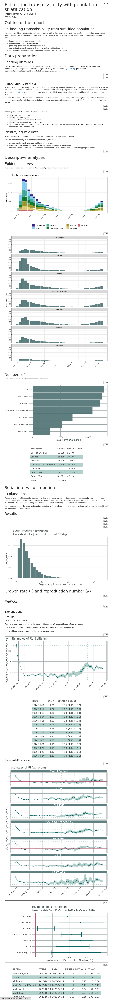

```{r, include = FALSE}
knitr::opts_chunk$set(
  collapse = TRUE,
  comment = "#>"
)
```

This package provides a store of curated outbreak analytics pipelines as 
rmarkdown reports.

## Loading reports

Reports are provided a [rmarkdown templates](https://rstudio.github.io/rstudio-extensions/rmarkdown_templates.html). You can load them either via RStudio graphical interface


or by running:

```{r, eval = FALSE}
rmarkdown::draft(
  file = "myreport.Rmd",
  template = "transmissibility-report",
  package = "soap"
)
```

To get a list of the template reports available in this package, you can run:

```{r}
soap::list_templates()
```

## Customising reports

The reports are classic `{rmarkdown}` files.
If you are familiar with `{rmarkdown}` and [literate programming](https://en.wikipedia.org/wiki/Literate_programming), you can edit any piece of the report as you see fit.

For users who want a more ready-to-use solution, reports are already set up to provide multiple options for your analysis out of the box. For example, in the `transmissibility-report`, you can choose to estimate the reproduction number in your data with different tools, such as `{EpiEstim}` or `{EpiNow2}`. This is achieved by changing the value of the `rt_estimator` parameter.

```{r}
# Load template in temporary directory for this vignette. You will probably
# wish to save it somewhere else.
rmarkdown::draft(
  file = file.path(tempdir(), "myreport"),
  template = "transmissibility-report",
  package = "soap",
  edit = FALSE
)
```

```{r, eval = FALSE}
# Report using EpiEstim to estimate Rt
rmarkdown::render(
  input = file.path(tempdir(), "myreport", "myreport.Rmd"),
  output_file = "EpiEstim_report.html",
  params = list(rt_estimator = "EpiEstim"),
  quiet = TRUE
)

# Report using R0 to estimate Rt
rmarkdown::render(
  input = file.path(tempdir(), "myreport", "myreport.Rmd"),
  output_file = "EpiNow2_report.html",
  params = list(rt_estimator = "EpiNow2"),
  quiet = TRUE
)
```

```{r, echo = FALSE, eval = FALSE}
webshot::rmdshot(
  file.path(tempdir(), "myreport", "myreport.Rmd"),
  file = file.path("vignettes", "transmissibility-EpiEstim.png"),
  rmd_args = list(
    params = list(rt_estimator = "EpiEstim"),
    quiet = TRUE
  )
)
webshot::rmdshot(
  file.path(tempdir(), "myreport", "myreport.Rmd"),
  file = file.path("vignettes", "transmissibility-EpiNow2.png"),
  rmd_args = list(
    params = list(rt_estimator = "EpiNow2"),
    quiet = TRUE
  )
)
```

```{css, echo = FALSE}
img {vertical-align: top;}
```

```{r, echo = FALSE, out.width="45%", fig.show='hold'}

knitr::include_graphics("transmissibility-EpiNow2.png")
```
